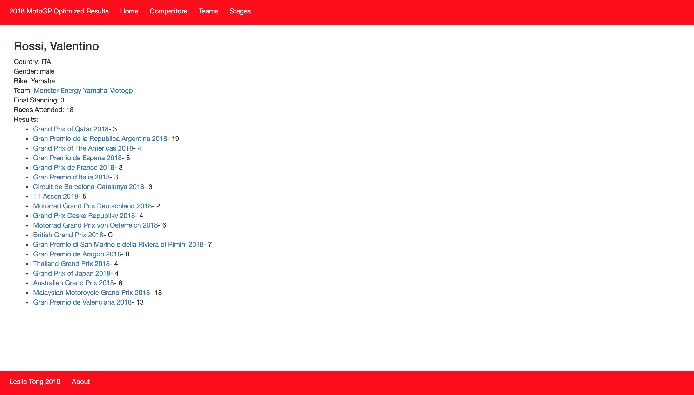
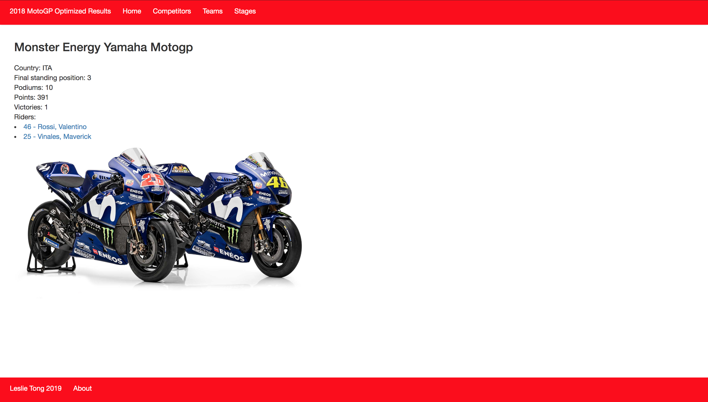
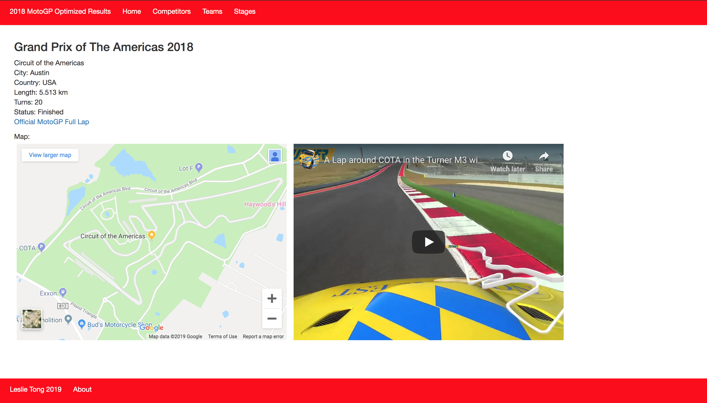
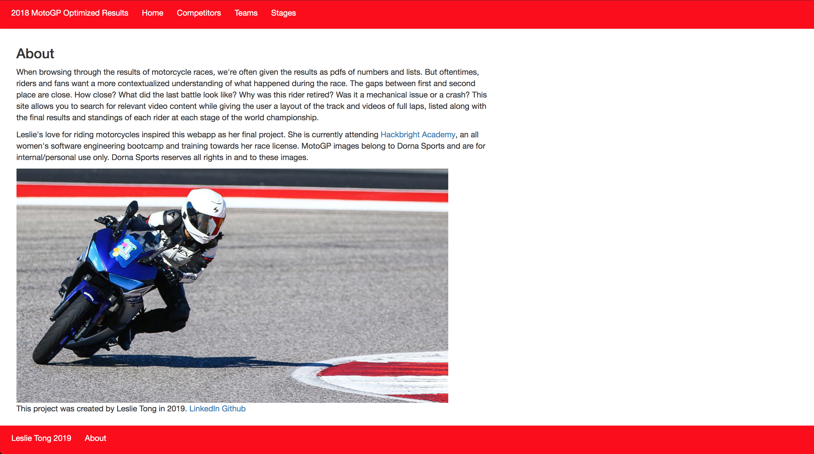

<h2> MotoGP Optimized Results</h2>

MotoGP Optimized Results is a webapp that serves the results of the motorcycle Grand Prix World Championship of 2018. It uses data scraped from Wikipedia with light aid of the SportRadar MotoGP API. The traditional way of serving racing results are done through PDFs. This delivery isn't comprehensive and interactive. It doesn't give a contextualized understanding of what happened during a race. MotoGP Optimized Results allow racers and fans that ride an in depth view of the race tracks made available by using interactive Google Maps and videos of on-board laps made available by the Youtube API.

Here is an example of using the Youtube API to retrieve results with some context:

Initially, I used SportRadar's API to build my SQL database. However, the JSON responses I received contained inaccurate data, mixing last year's results with this year's, which is still ongoing. In this time frame, I resolved to only using data from 2018 by scraping from Wikipedia. Hopefully in the future, with a more reliable source, I can implement all the data from every MotoGP race, dating back to the first one in 1949.

 

One the of most exciting features of my webapp is the ability to analyze the race track using Google Map's API, while watching an on-board lap of the same track using Youtube's API. This gives track riders and racers an in depth look of the geographical nuances of each track, the difficulty of each turn, and other challenges of competing in the world championship. 

I'm excited to continue this project and I hope it can be a useful tool for other riders like myself in the future. Thanks for checking out my github and I'll see you around on the road (or on the internet). :)

